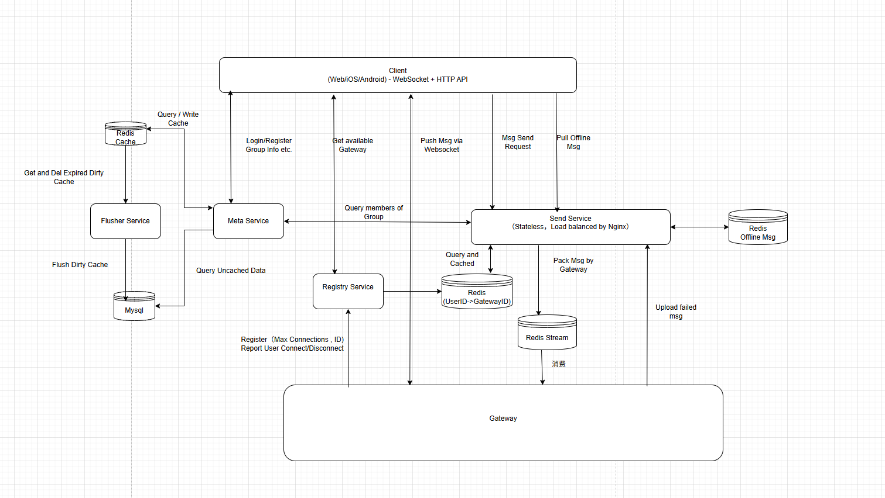

# GoStacker - 高性能分布式IM后端系统

<div align="center">


一个基于 Go 语言开发的高性能、可扩展的分布式即时通讯（IM）系统后端

[特性](#-核心特性) • [架构](#-系统架构) • [快速开始](#-快速开始) • [文档](#-文档)

</div>

---

## 📖 项目简介

GoStacker 是一个分布式 IM 后端系统。系统采用微服务架构，通过服务注册中心实现动态负载均衡和服务发现，提供高可用、高性能的消息推送能力。


## ✨ 核心特性

### 🚀 高性能
- **批量消息处理**：智能批处理（100用户/批）减少网络开销
- **异步推送**：基于 Redis Stream 的消息队列解耦推送链路
- **二级缓存**：本地缓存 + Redis 缓存

### 🏗️ 分布式架构
- **微服务设计**：Gateway、Send、Meta、Registry 四大服务独立部署
- **服务注册发现**：Registry 中心化管理，心跳健康检查
- **动态负载均衡**：基于实时负载的智能路由选择
- **水平扩展**：所有服务支持多实例部署

### 💾 数据可靠性
- **缓存写回机制**：群组数据批量刷盘，减少 DB 压力
- **消息 ACK 确认**：Pending Task 追踪消息推送状态
- **优雅关机**：确保消息不丢失的平滑下线

### 🔍 可观测性
- **Prometheus 监控**：暴露 `/metrics` 端点，支持 Grafana 可视化
- **结构化日志**：Zap 日志，支持日志轮转和分级
- **性能追踪**：自研 Monitor 系统追踪 API 延迟和成功率

---

## 🏛️ 系统架构

### 架构图

### 服务说明

| 服务 | 职责  | 部署模式 |
|------|------|----------|
| **Meta** | 用户管理、群组管理、认证  | 多实例 |
| **Send** | 消息接收、路由分发  | 多实例 |
| **Registry** | 服务注册、负载均衡、用户路由  | 单实例/集群 |
| **Gateway** | WebSocket 连接、消息推送  | 多实例 |

---

## 🛠️ 技术栈

### 后端框架
- **语言**：Go 1.25+
- **Web 框架**：Gin
- **WebSocket**：Gorilla WebSocket

### 数据存储
- **关系型数据库**：MySQL 8.0+
- **缓存/队列**：Redis 7.0+
- **ORM**：原生 SQL（高性能场景）

### 中间件
- **消息队列**：Redis Stream
- **配置管理**：Viper (支持热加载)
- **日志**：Zap (结构化日志)

### 监控与运维
- **监控**：Prometheus + Grafana
- **健康检查**：HTTP `/health` `/ping` 端点

---

## 🚀 快速开始

### 前置要求

```bash
Go >= 1.25
MySQL >= 8.0
Redis >= 7.0
```

### 1. 克隆项目

```bash
git clone https://github.com/your-org/GoStacker.git
cd GoStacker
```

### 2. 初始化数据库

```bash
# 创建数据库
mysql -u root -p < model/chat_message.sql
mysql -u root -p < model/chat_room.sql
mysql -u root -p < model/user.sql
```

### 3. 配置文件

复制并修改配置文件：

```bash
cp config.yaml.example config.yaml
cp config.gateway.yaml.example config.gateway.yaml
cp config.send.yaml.example config.send.yaml
cp config.meta.yaml.example config.meta.yaml
cp config.registry.yaml.example config.registry.yaml
```

修改 config.yaml 中的数据库和 Redis 连接信息：

```yaml
mysql:
  host: "127.0.0.1"
  port: 3306
  user: "root"
  password: "your_password"
  dbname: "gostacker"

redis:
  host: "127.0.0.1"
  port: 6379
  password: ""
  db: 0
  pool_size: 100
```

### 4. 编译项目

```bash
# Windows
.\build.bat

# Linux/Mac
go build -o bin/meta ./cmd/meta
go build -o bin/send ./cmd/send
go build -o bin/gateway ./cmd/gateway
go build -o bin/registry ./cmd/registry
```

### 5. 启动服务

#### 方式一：独立模式（适合开发测试）

```bash
# 启动 Registry
./bin/registry -config config.registry.yaml

# 启动 Meta
./bin/meta -config config.meta.yaml

# 启动 Send
./bin/send -config config.send.yaml

# 启动 Gateway
./bin/gateway -config config.gateway.yaml
```

#### 方式二：一键启动（Windows）

```bash
.\start.bat
```

### 6. 验证服务

```bash
# 检查 Meta 服务
curl http://localhost:8080/health

# 检查 Registry
curl http://localhost:8084/registry/gateway/instances

# 检查 Prometheus 指标
curl http://localhost:8080/metrics
```

---

## 📝 API 文档

### Meta 服务 (8080)

#### 用户认证

**登录**
```http
POST /api/user/login
Content-Type: application/json

{
  "username": "user1",
  "password": "password123"
}

Response:
{
  "code": 200,
  "message": "success",
  "data": {
    "token": "eyJhbGciOiJIUzI1NiIs...",
    "user_id": 10001
  }
}
```

**注册**
```http
POST /api/user/register
Content-Type: application/json

{
  "username": "newuser",
  "password": "password123",
  "nickname": "昵称"
}
```

#### 群组管理

**创建群组**
```http
POST /api/group/create
Authorization: Bearer <token>
Content-Type: application/json

{
  "name": "技术讨论组",
  "member_ids": [10001, 10002, 10003]
}
```

**查询群组成员**
```http
GET /api/group/:room_id/members
Authorization: Bearer <token>
```

### Send 服务 (8081)

**发送消息**
```http
POST /api/chat/send_message
Authorization: Bearer <token>
Content-Type: application/json

{
  "room_id": 1001,
  "content": "Hello, World!",
  "type": "text"
}
```

### Gateway 服务 (8082+)

**WebSocket 连接**
```javascript
const ws = new WebSocket('ws://gateway-host:8082/api/ws?token=<jwt_token>');

ws.onmessage = (event) => {
  const msg = JSON.parse(event.data);
  console.log('收到消息:', msg);
};

// 消息格式
{
  "id": 123456,
  "type": "chat",
  "room_id": 1001,
  "sender_id": 10001,
  "payload": {
    "content": "Hello!",
    "timestamp": "2026-01-07T10:00:00Z"
  }
}
```

### Registry 服务 (8084)

**获取可用 Gateway**
```http
GET /registry/gateway/available?user_id=10001

Response:
{
  "code": 200,
  "data": {
    "gateway_id": "gateway-1-123",
    "address": "192.168.1.100",
    "port": 8082,
    "load": 0.35
  }
}
```

---

## ⚙️ 配置说明

### Gateway 配置 (config.gateway.yaml)

```yaml
name: "gateway-1"
port: 8082
address: "192.168.1.100"
machine_id: 1

# 推送分发器配置
dispatcher:
  max_connections: 100000      # 最大连接数
  worker_count: 10             # Worker 数量
  send_channel_size: 1024      # 发送队列大小
  stream_name: "gateway-1_stream"
  group_name: "gateway_group"
  consumer_name: "consumer-1"
  interval: 5                  # 消费间隔（秒）

# Registry 配置
registry:
  url: "http://localhost:8084"
  gateway_heartbeat_timeout: 30  # 心跳超时（秒）

redis:
  host: "127.0.0.1"
  port: 6379
  pool_size: 200

log:
  level: "info"
  filename: "logs/gateway.log"
  max_size: 100
  max_backups: 5
  max_age: 30
```

### 性能调优参数

| 参数 | 说明 | 推荐值 |
|------|------|--------|
| `max_connections` | Gateway 最大连接数 | 100000 |
| `worker_count` | 推送 Worker 数量 | CPU 核心数 x 2 |
| `pool_size` | Redis 连接池大小 | 200-500 |
| `send_channel_size` | 发送队列大小 | 1024-4096 |

